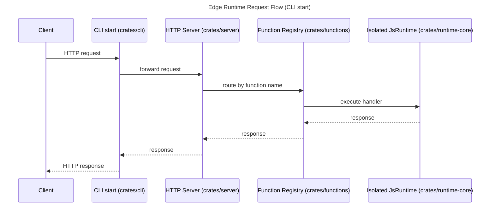

<p align="center">
  
</p>

<a href="https://github.com/thunder-edge/runtime/actions/workflows/ci-cd.yml"></a>


Thunder is a Rust-powered edge runtime and ecosystem built on the Deno stack, designed to run JavaScript and TypeScript functions with modern Web APIs, strong per-function isolation, and a CLI-first workflow with a built-in testing framework. ⚡

## Project Goal

This repository implements a runtime for edge/serverless workloads with:

- JS/TS function execution in V8 isolates
- code packaging in ESZIP format
- dynamic deployment through an internal HTTP API
- development mode with watch + hot update
- JS/TS test support through the `thunder:testing` library
- observability (metrics, health, logs)

The project is organized as a Rust workspace with specialized crates for runtime, function orchestration, HTTP serving, and CLI tooling.

## Architecture

Request flow in `start` mode (side-by-side):



### `crates/runtime-core`

Runtime core:

- creates and configures `JsRuntime` (V8 + Deno extensions)
- integrates Web extensions (`fetch`, `crypto`, `streams`, `url`, etc.)
- defines runtime permission/sandbox behavior
- loads modules from ESZIP
- includes memory and CPU limit components

### `crates/functions`

Function lifecycle and registry layer:

- function deploy/update/delete
- isolate creation and shutdown per function
- request routing to the correct isolate
- per-function metrics collection

### `crates/server`

HTTP ingress server and control API:

- ingress: `/{function_name}/...`
- internal endpoints under `/_internal/*`
- health, metrics, and function management endpoints

### `crates/cli`

`thunder` binary for local and CI usage:

- `start`: starts the runtime server
- `bundle`: generates a serialized ESZIP package
- `watch`: watches files and performs automatic deploy/update
- `test`: runs JS/TS tests inside the runtime
- `check`: runs typecheck/syntax checks for JS/TS sources

## Requirements

- Rust toolchain (recommended via the project's `rust-toolchain.toml`)
- Cargo
- Optional: `deno` in `PATH` for TS semantic typecheck in `bundle` and `check`
- Optional: `k6` for load testing (see [load_testing.md](docs/load_testing.md))

## Quick Build

```bash
cargo build
```

## Quick Flow (start -> bundle -> deploy -> invoke)

1. Start the server:

```bash
cargo run -- start --host 0.0.0.0 --port 9000
```

2. Generate an ESZIP bundle:

```bash
cargo run -- bundle \
  --entrypoint ./examples/hello/hello.ts \
  --output ./hello.eszip
```

Or generate a snapshot envelope bundle (with ESZIP fallback):

```bash
cargo run -- bundle \
  --entrypoint ./examples/hello/hello.ts \
  --output ./hello.snapshot.bundle \
  --format snapshot
```

3. Deploy the function:

```bash
curl -X POST http://localhost:9000/_internal/functions \
  -H "x-function-name: hello" \
  --data-binary @./hello.eszip
```

4. Invoke the function:

```bash
curl http://localhost:9000/hello
```

5. Check metrics:

```bash
curl http://localhost:9000/_internal/metrics
```

## Main CLI Commands

```bash
cargo run -- start
cargo run -- bundle --entrypoint ./examples/hello/hello.ts --output ./hello.eszip
cargo run -- bundle --entrypoint ./examples/hello/hello.ts --output ./hello.snapshot.bundle --format snapshot
cargo run -- watch --path ./examples --port 9000
cargo run -- test --path "./tests/js/**/*.ts" --ignore "./tests/js/lib/**"
cargo run -- check --path "./**/*.{ts,js,mts,mjs,tsx,jsx,cjs,cts}"
```

Detailed CLI documentation: [docs/cli.md](docs/cli.md).

## `docs/` Folder Guide

- [docs/cli.md](docs/cli.md): full reference for CLI commands (`start`, `bundle`, `watch`, `test`, `check`)
- [docs/debugging.md](docs/debugging.md): debugging with the V8 inspector via VS Code, Chrome DevTools, and Neovim
- [docs/testing-library.md](docs/testing-library.md): usage guide for the `edge://assert/*` library (assertions, suites, hooks, mocks, snapshots)
- [docs/testing-api-reference.md](docs/testing-api-reference.md): detailed API reference for test functions
- [docs/load_testing.md](docs/load_testing.md): methodology and interpretation of load tests with k6
- [docs/streaming-response-body.md](docs/streaming-response-body.md): how to use `ReadableStream`, chunked transfer, and SSE in JS/TS handlers
- [docs/external-scaling-recommendations.md](docs/external-scaling-recommendations.md): recommended metrics and guardrails for external autoscaling
- [docs/bundle-signing.md](docs/bundle-signing.md): generate, store, rotate, and enforce Ed25519 bundle signatures for secure deploys
- [docs/observability-stack.md](docs/observability-stack.md): docker compose stack with OTEL Collector, Tempo, Loki, Prometheus, and Grafana
- [docs/web_standards_api_report.md](docs/web_standards_api_report.md): compatibility report for Web APIs supported by the runtime

## Internal Runtime API

Main endpoints under `/_internal`:

- `GET /_internal/health`
- `GET /_internal/metrics`
- `GET /_internal/functions`
- `POST /_internal/functions` (header `x-function-name` + binary body)
- `GET /_internal/functions/{name}`
- `PUT /_internal/functions/{name}`
- `DELETE /_internal/functions/{name}`
- `POST /_internal/functions/{name}/reload` (feature `hot-reload`)

Function execution route:

- `/{function_name}/...`

## Snapshot Compatibility Note

If you deploy snapshot-formatted bundles, snapshots are tied to the V8 version that produced them.

- On V8/runtime upgrades, existing snapshots may become incompatible.
- Runtime automatically falls back to ESZIP startup when mismatch is detected.
- Regenerate and redeploy snapshots after V8 changes to restore optimal cold-start performance.

Use `GET /_internal/functions` or `GET /_internal/functions/{name}` to inspect:

- `package_v8_version`
- `runtime_v8_version`
- `requires_snapshot_regeneration`

## Development Mode with Watch

```bash
cargo run -- watch --path ./examples --inspect 9229
```

- watches `.ts` and `.js`
- performs automatic deploy/update
- can expose a V8 inspector per function

Debug guide: [docs/debugging.md](docs/debugging.md).

## Tests

### Rust

```bash
cargo test
```

Faster local workflows:

```bash
# Fast dev loop (skips heavy E2E/stress patterns and excludes edge-server crate)
cargo test-dev

# Full Rust suite (workspace)
cargo test-full

# Focused server E2E when needed
cargo test-server-e2e
```

### JS/TS in the Runtime

```bash
cargo run -- test --path "./tests/js/**/*.ts" --ignore "./tests/js/lib/**"
```

Testing library references:

- [docs/testing-library.md](docs/testing-library.md)
- [docs/testing-api-reference.md](docs/testing-api-reference.md)

## Benchmarks and Load Testing

Scripts in `scripts/` cover bundling, deployment, and benchmarking with k6.

Examples:

```bash
./scripts/run-benchmarks.sh
./scripts/quick-benchmark.sh both
```

See also:

- [docs/load_testing.md](docs/load_testing.md)
- [scripts/README.md](scripts/README.md)

## Web APIs Compatibility

Current report: [docs/web_standards_api_report.md](docs/web_standards_api_report.md).

Reported summary:

- Full: 62/81 (77%)
- Partial: 3/81 (4%)
- None: 16/81 (20%)

## Security and Current Status

There is a technical audit and a hardening roadmap in the repository:

- [AUDIT.md](AUDIT.md)
- [ROADMAP.md](ROADMAP.md)

Relevant findings from the audit (05/03/2026):

- TLS is configured in the server, but not yet applied in the accept loop
- `/_internal/*` endpoints are not authenticated
- SSRF risk due to permissive network rules in `fetch`
- no request/response body size limits

Before production use, prioritize Phase 0 items in [ROADMAP.md](ROADMAP.md).

## Repository Structure

```text
crates/
  cli/           # binary and commands
  server/        # HTTP server and routing
  functions/     # function lifecycle/registry
  runtime-core/  # V8 + extensions + sandbox

docs/            # guides (CLI, debug, tests, load, web compatibility)
examples/        # example functions in TS/ESZIP
scripts/         # benchmark/deploy automation
tests/js/        # JS/TS test suites
```

## License

MIT (see workspace `Cargo.toml`).

