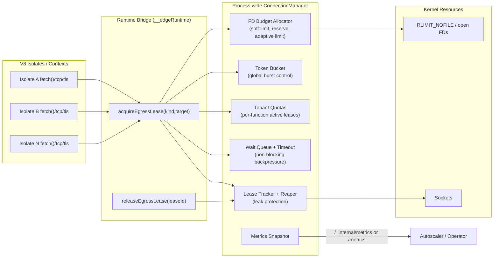

# Egress Connection Manager

This document describes the global outbound connection manager used to protect the runtime from FD exhaustion under high concurrency.

## High-level architecture

## Components and responsibilities

- `ConnectionManager` (Rust, process-global): arbitration for outbound socket leases shared by all isolates.
- FD budget allocator: computes reserve and adaptive global active limit from `RLIMIT_NOFILE` plus current open FD count.
- Token bucket: rate-limits socket-creation bursts even when free capacity exists.
- Tenant quota map: caps active leases per tenant/function to prevent noisy-neighbor starvation.
- Queue + timeout: callers wait asynchronously for capacity with bounded queue depth and deadline.
- Lease tracker: tracks active leases by `lease_id`, `execution_id`, tenant, and birth time.
- Leak reaper: background sweep that force-releases stale leases older than hard TTL.
- Metrics exporter: publishes counters and internal state to `/_internal/metrics` and `/metrics`.

For immediate control-loop reads, prefer `?fresh=1` (for example, `/metrics?fresh=1`).

## Data structures

- `leases: Mutex<HashMap<u64, LeaseMeta>>`
- `tenant_active: DashMap<String, usize>`
- `token_bucket: Mutex<TokenBucketState>`
- Atomics:
  - `active_leases`
  - `queued_waiters`
  - `total_acquired`
  - `total_released`
  - `total_rejected`
  - `total_timeouts`
  - `total_reaped`
- `Notify`: wake queued waiters after lease release.

## Core algorithms

### FD Budget Allocator

1. Read `soft_limit` from `getrlimit(RLIMIT_NOFILE)`.
2. Read `open_fd_count` from `/proc/self/fd` or `/dev/fd`.
3. Compute reserved margin:
   - `max(fd_reserved_absolute, soft_limit * fd_reserved_ratio)`.
4. Compute outbound budget:
   - `soft_limit - reserved`.
5. Apply adaptive pressure factor based on `open_fd_count / soft_limit`:
   - `>= 0.90 -> 0.25`
   - `>= 0.80 -> 0.50`
   - `>= 0.70 -> 0.75`
   - else `1.00`.
6. Effective active limit:
   - `outbound_budget * pressure_factor`.

### Token Bucket

- Bucket state: `{ tokens, capacity, refill_per_sec, last_refill }`.
- Refill on acquire attempt:
  - `tokens = min(capacity, tokens + elapsed * refill_per_sec)`.
- Consume 1 token per lease acquisition.
- Capacity/refill are adjusted from adaptive active limit.

## Integration points

- Runtime bridge (`crates/functions/src/handler.rs`):
  - `acquireEgressLease(kind, target, timeoutMs)`
  - `releaseEgressLease(leaseId)`
  - `releaseExecutionEgressLeases(executionId)`
- Wrapped `globalThis.fetch`:
  - acquires lease before outbound call
  - releases in `finally`.
- Execution cleanup:
  - on `endExecution` and `clearExecutionTimers`, all leases bound to execution are force-released.

## High-concurrency FD protection strategies

- Global process-wide leasing (not per-isolate local counters).
- Hard queue limit to avoid memory blow-up under overload.
- Timeout-based backpressure (fast fail instead of lockstep blocking).
- Per-tenant caps to preserve fairness.
- Adaptive throttling by observed FD pressure.
- Leak-reaper safety net.

## Failure scenarios and recovery

- Burst opens too many sockets:
  - token bucket and adaptive limit throttle new leases.
- Near-FD exhaustion:
  - allocator reduces active limit, acquisitions become backpressured/timed out.
- Noisy tenant consumes budget:
  - per-tenant cap blocks additional leases from that tenant.
- Aborted/terminated execution leaks leases:
  - execution-level release on cleanup + hard-TTL reaper.
- Queue saturation:
  - immediate backpressure error instead of unbounded wait.

## Recommended defaults

- `fd_reserved_absolute`: `512`
- `fd_reserved_ratio`: `0.20`
- `queue_max_waiters`: `50_000`
- `default_wait_timeout`: `75ms`
- `per_tenant_max_active`: `2048`
- `lease_hard_ttl`: `300s`
- `min_token_refill_per_sec`: `256`

These defaults favor process stability first and can be tuned based on real traffic shape and upstream latency distributions.
