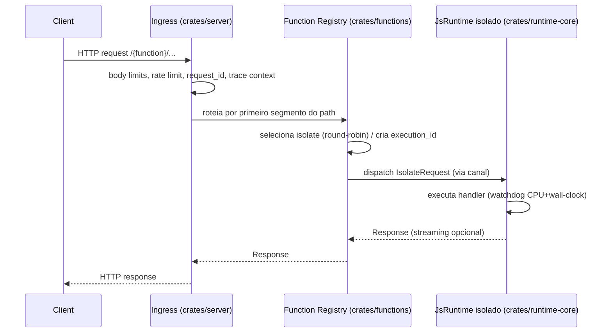

# Arquitetura atual — Thunder Runtime

Thunder é um **edge runtime** em Rust construído sobre a stack Deno (deno_core + V8),
que executa funções JavaScript/TypeScript em isolates V8 com APIs Web modernas,
isolamento forte por função e um fluxo CLI-first com framework de testes embutido.

## 1. Workspace de crates

O runtime é um workspace Rust com 4 crates especializadas:

```
runtime/crates/
├── runtime-core/   # Engine de execução JS: V8 + extensões Deno + sandbox
├── functions/      # Registry, ciclo de vida de isolates, connection manager
├── server/         # Ingress HTTP + Admin API (dual-listener)
└── cli/            # Binário `thunder`: start, bundle, watch, test, check
```

| Crate | Responsabilidade central | Módulos-chave |
|-------|--------------------------|---------------|
| `runtime-core` | Criar/configurar `JsRuntime`, extensões Web, sandbox, limites de heap/CPU, carregamento de módulos ESZIP, node_compat | `isolate.rs`, `extensions.rs`, `manifest.rs`, `permissions.rs`, `module_loader.rs`, `ssrf.rs`, `cpu_timer.rs`, `mem_check.rs`, `node_compat/` |
| `functions` | Deploy/update/delete de funções, pool de isolates por função, roteamento por nome, métricas, connection manager de egress | `registry.rs`, `lifecycle.rs`, `handler.rs`, `connection_manager.rs`, `snapshot.rs`, `metrics.rs`, `types.rs` |
| `server` | Ingress HTTP público, Admin API, TLS/mTLS, streaming, limites de corpo, trace context | `ingress_router.rs`, `admin_router.rs`, `router.rs`, `tls.rs`, `body_limits.rs`, `bundle_signature.rs`, `global_routing.rs`, `graceful.rs` |
| `cli` | Binário `thunder` para dev/CI/operação | `commands/{start,bundle,watch,test,check}.rs`, `telemetry.rs` |

## 2. Fluxo de request (modo `start`)



## 3. Topologia dual-listener

```
┌─ Admin listener (padrão :9000, localhost)      ┌─ Ingress listener (padrão :8080 ou Unix socket)
│  Auth: header X-API-Key                          │  Público
│  Rotas: /_internal/* (deploy, reload)            │  Rotas: /{function_name}/*
│  Inclui /metrics e /health                       │  TLS opcional (hot-reload de cert)
└─ Operações privilegiadas isoladas               └─ Rate limiting, body limits, request_id
```

Motivação: separar operações privilegiadas (deploy/reload/metrics) do tráfego público.
Ver ADR-0005.

## 4. Modelo de isolamento

- **Atual (as-is):** cada função → `FunctionEntry` com N isolates replicados (round-robin).
  Cada isolate = thread OS dedicada + `JsRuntime` + loop de canal de requests.
- **Alvo (to-be, ROADMAP_CONTEXT_ISOLATE.md):** N contextos por isolate compartilhando um
  `JsRuntime`; auto-scale de contexto → isolate → shedding na saturação.
- **Por request:** `execution_id` (UUID) rastreia timers/intervals/promises/recursos para
  limpeza determinística no timeout ou término. Ver ADR-0006.

Limites configuráveis (`IsolateConfig`): heap (128 MiB padrão), CPU (50 s), wall-clock (60 s),
VFS quota (10 MiB), egress máx. por execução, contextos por isolate.

## 5. Formatos de bundle

- **ESZIP** — formato canônico (grafo de módulos pré-serializado). Ver ADR-0002.
- **Snapshot V8** — cache de bytecode para cold-start mais rápido, com **fallback para ESZIP**
  em mismatch de versão V8. Removido e depois re-adicionado (ver decisions-inferred.md e ADR-0003).

## 6. Roteamento e manifest

- **Manifest v2** (JSON Schema 2020-12) em `runtime/schemas/function-manifest.v2.schema.json`;
  v1 foi removido. Ver ADR-0009.
- **Flavors:** `single` (um handler) e `routed-app` (diretório de rotas + assets, estilo Next.js/Remix).
- **Global routing manifest:** mapeamento domínio → função (`global_routing.rs`).

## 7. Segurança

- **SSRF deny list** por padrão (ranges IP privados bloqueados), com allowlist por manifest. Ver ADR-0007.
- **Connection manager de egress** global: budget de FD, token bucket, quotas por função, reaper. Ver ADR-0008.
- **Bundle signing** Ed25519 opcional no deploy. Ver ADR-0012.
- **Global API hardening:** impede sobrescrita de primitivas críticas do runtime.
- **TLS** com hot-reload de certificado via file watcher.
- Auditoria de segurança e gaps conhecidos (ex.: bypass SSRF IPv6-mapped): `runtime/AUDIT.md`.

## 8. Compatibilidade Node.js

Camada `node_compat/` com ~35 módulos builtin (full/partial/stub) via shim TS + ops nativas,
para suportar frameworks SSR (Next.js, Astro, Vite). VFS provê `/bundle` (RO), `/tmp` (RW, quota),
`/dev/null`. Ver ADR-0011 e `runtime/docs/reference/NODE-COMPAT.md`.

## 9. Observabilidade

Stack OpenTelemetry (traces, métricas, logs) com exportador OTLP; W3C Trace Context.
Coletor → Tempo/Loki/Prometheus. Ver ADR-0010 e `runtime/docs/guides/observability-stack.md`.

## 10. Ferramentas & toolchain

- **Build/test:** `cargo build --locked`, `cargo test`, `Makefile` (targets de load test etc.)
- **Lint/format:** `clippy`, `rustfmt`
- **Toolchain:** Rust 1.90 (`rust-toolchain.toml`)
- **CI:** GitHub Actions (`.github/workflows/ci-cd.yml`) — build, test, release multiplataforma
- **Testes JS/TS:** biblioteca `thunder:testing` (`edge://assert/*`), executada via `thunder test`
