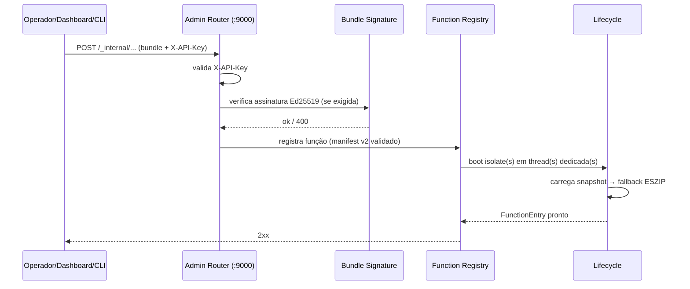
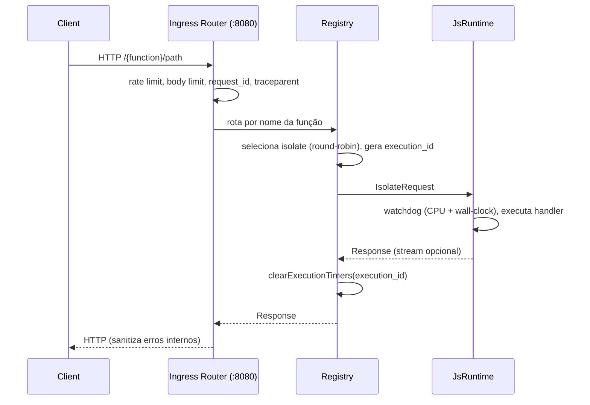
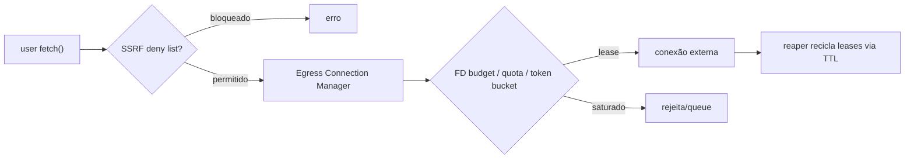
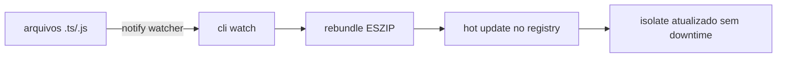

# Fluxos de negócio — Thunder Runtime

## 1. Deploy de função (Admin API)

## 2. Execução de request (ingress)

## 3. Egress do código de usuário

## 4. Timeout e limpeza de recursos

- **CPU time** (`cpu_timer.rs`) via `CLOCK_THREAD_CPUTIME_ID`; flag de excedido encerra execução.
- **Wall-clock** (`wall_clock_timeout_ms`) com watchdog + `tokio::time::timeout` (dupla camada).
- **OOM** (`mem_check.rs`): callback de limite de heap V8, extensão em estágios + terminação graciosa.
- Timeout de isolate → HTTP **504**; isolate morto → auto-restart com backoff exponencial.

## 5. Modo de desenvolvimento (`watch`)

