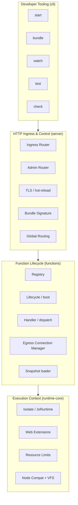

# Bounded Contexts — Thunder Runtime

Mapa de domínios e fronteiras de responsabilidade inferidas do código e do histórico Git
(arquivos que mudam juntos tendem a pertencer ao mesmo contexto).

## Contextos

| Bounded Context | Crate | Responsabilidade | NÃO é responsável por |
|-----------------|-------|------------------|------------------------|
| **Execution** | `runtime-core` | Executar JS/TS com segurança, aplicar limites, prover APIs Web e Node | Roteamento HTTP, deploy, autenticação de admin |
| **Function Lifecycle** | `functions` | Deploy/update/delete, pool de isolates, routing por nome, egress leasing, métricas por função | Terminação TLS, parsing de HTTP bruto |
| **HTTP Ingress & Control** | `server` | Ingress público, Admin API, TLS, limites de corpo, assinatura de bundle, trace context | Execução de código de usuário, gestão de heap V8 |
| **Developer Tooling** | `cli` | UX de dev/CI/operação: start/bundle/watch/test/check, telemetria | Lógica de negócio de execução (delega às crates) |

## Fronteiras e contratos internos

- `server → functions`: roteia request pelo primeiro segmento do path para o `FunctionRegistry`.
- `functions → runtime-core`: dispatch de `IsolateRequest` via canal para o `JsRuntime` na thread do isolate.
- `cli → server/functions`: `start` compõe listeners + registry; `bundle` gera ESZIP/snapshot; `test` roda no isolate.
- Contrato de função de usuário: `Deno.serve()` / handler exportado (ver `runtime/docs/reference/FUNCTION_CONTRACT_README.md`).

## Sinais de acoplamento (do histórico Git)

Arquivos mais voláteis e que co-evoluem: `functions/src/lifecycle.rs`, `server/src/lib.rs`,
`server/src/router.rs`, `functions/src/registry.rs`, `functions/src/handler.rs` — indicando que
o eixo **lifecycle ↔ ingress ↔ registry** é o núcleo quente do sistema e o mais sensível a regressões.
